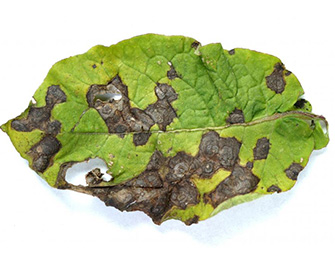

# SmartAgriculture: Agricultural Analysis Suite

"SmartAgriculture" is a comprehensive web application designed to assist in agricultural decision-making, offering tools for plant disease detection, optimal seed planting guidance, and sensor data monitoring.

## Features

*   **Precise Leaf Disease Detection:** This feature allows users to upload images of plant leaves, which are then analyzed by a pre-trained **MobileNetV2** deep learning model to accurately identify various plant diseases. It provides quick, actionable insights into plant health.
*   **Optimal Seed Planting Guidance:** This module provides data-driven recommendations for ideal seed size, sowing depth, and plant spacing. It leverages machine learning models that consider multiple agricultural parameters such as selected crop type, geographical region, current season, prevalent soil type, ambient temperature, soil moisture levels, and soil pH.
*   **Real-time Weather Integration:** The application dynamically fetches current temperature, wind speed, and other atmospheric conditions based on the user's geographical location using the **Open-Meteo API**. This integration provides crucial environmental context for agricultural predictions, with no API key required for basic usage.
*   **Flexible Sensor Data Input:** Users can opt to integrate with external hardware sensors (e.g., ESP32, Arduino-based devices) to automatically populate environmental parameters like temperature, humidity, and soil moisture. The system supports direct fetching from a user-configured sensor URL or falls back to using included mock sensor data (`plant_data.json` updated by `plant_monitor.py`) for demonstration and testing purposes. Detailed setup instructions for ESP32 integration are available within the application via the "Sensor Setup Docs" page.
*   **User-Friendly Interface:** The entire system is presented through a modern, responsive web interface built with **Flask**, **HTML**, **CSS**, and **JavaScript**. It is designed for intuitive interaction, allowing for easy data input, clear visualization of predictions, and practical growing tips.

## Setup

To set up and run the Leaf application, follow these steps:

1.  **Clone the repository:**

    ```bash
    git clone https://github.com/KrupalWarale/SmartAgriculture-Smart-Plant-Monitoring-and-Disease-Detection-System.git
    cd SmartAgriculture-Smart-Plant-Monitoring-and-Disease-Detection-System

    ```

2.  **Create a virtual environment (recommended):**

    ```bash
    python -m venv venv
    # On Windows:
    venv\Scripts\activate
    # On macOS/Linux:
    source venv/bin/activate
    ```

3.  **Install the required packages:**

    ```bash
    pip install -r requirements.txt
    ```

## Running the Application

1.  **Start the Flask server:**

    ```bash
    python app.py
    ```

2.  Open your web browser and navigate to:

    ```
    http://localhost:8000
    ```

## Usage

*   **Disease Detection:** Go to the "Leaf Disease" section, upload a leaf image, and get instant predictions. Navigate to the "Leaf Disease" section, upload an image of a plant leaf, and receive immediate predictions on potential diseases and their confidence levels. Sample images for testing can be found in the `static/uploads` directory. [click here](https://github.com/KrupalWarale/SmartAgriculture-Smart-Plant-Monitoring-and-Disease-Detection-System/tree/main/static/uploads)

    Here's an example of a diseased leaf image:
    <br>
    
*   **Seed Planting Guidance:** Visit the "Seed Size Analysis" page, input or fetch environmental data, and receive tailored recommendations.
*   **Sensor Data:** Use the "Fetch Sensor" button on the "Seed Size Analysis" page to get data from a configured external sensor or the built-in mock data. Click "Configure Sensor" to set up your own device, or "Sensor Setup Docs" for detailed guidance on connecting an ESP32.
*   **Weather Data:** Use the "Fetch Data" button to automatically retrieve local weather conditions based on your browser's geolocation.

## Technical Details

*   **Backend Architecture:** The application's backend is developed using **Flask**, a lightweight and flexible Python web framework. It handles all routing, processes incoming requests, manages data flow, and serves the machine learning prediction results to the frontend.
*   **Frontend Technologies:** The user interface is built using standard web development languages: **HTML** for structuring content, **CSS** for styling and visual presentation, and **JavaScript** for interactive elements, dynamic content updates, and asynchronous API calls.
*   **Machine Learning Models:**
    *   **Leaf Disease Detection:** This feature utilizes a pre-trained **MobileNetV2** model for image classification, integrated seamlessly using the Hugging Face **Transformers** library. This model has been fine-tuned for high accuracy in identifying various plant diseases.
    *   **Agricultural Predictions:** The core predictive models for seed size, sowing depth, and spacing are loaded from `agricultural_models.pkl`. These are ensemble models (e.g., **RandomForestClassifier** and **RandomForestRegressor**) trained on diverse agricultural datasets. Categorical inputs (like crop names, regions, seasons, and soil types) are processed using **Label Encoders** stored in `unique_values.pkl`.
*   **Data Management:** Sensor data, when not fetched from an external source, is simulated and managed through `plant_data.json` located in `seedSize/sensorData`. This data can be updated by running the `plant_monitor.py` script. The system is designed to seamlessly integrate with custom JSON endpoints from hardware sensors.
*   **External API Integration:** The application consumes weather data from the **Open-Meteo API** to provide current environmental conditions, enhancing the accuracy of agricultural predictions without requiring an API key for its free tier.

## Project Structure

```
leaf/
├── agricultural_models.pkl
├── app.py
├── Procfile
├── requirements.txt
├── seedSize/
│   ├── sensorData/
│   │   ├── plant_data.json
│   │   └── plant_monitor.py
├── static/
│   ├── css/
│   ├── images/
│   │   └── soil_types/
│   │       ├── img/
│   │       └── soil_styles.css
│   │       └── soil_types.js
│   ├── js/
│   │   └── weatherService.js
│   ├── soil_types.json
│   ├── styles.css
│   ├── taro-leaves-leaf-1296x728-header.webp
│   └── uploads/
├── templates/
│   ├── homepage.html
│   ├── leaf_disease_index.html
│   ├── seed_size_index.html
│   ├── sensor_docs.html
│   └── taro-leaves-leaf-1296x728-header.webp
└── unique_values.pkl
```

## Further Understanding: A Guided Tour Through Related Projects

To fully grasp the depth and individual working mechanisms of the key components integrated into "Leaf", you can explore their dedicated foundational repositories. Each project focuses on a specific aspect, providing detailed insights into its development, methodologies, and underlying code:

*   **For an in-depth look at the automated plant monitoring and irrigation system, including sensor integration and water pump control logic, you can visit:**
    *   [Automated-remote-Plant-irrigation-system](https://github.com/KrupalWarale/Automated-remote-Plant-irrigation-system)

*   **To understand the intricacies of the MobileNetV2 model, its training process with the PlantVillage dataset, and the complete pipeline for precise leaf disease identification, please refer to:**
    *   [Leaf-Disease-detection-precise-prediction](https://github.com/KrupalWarale/Leaf-Disease-detection-precise-prediction)

*   **If you're interested in the machine learning models and methodologies behind predicting optimal seed size, sowing depth, and sowing spacing, the following repository provides comprehensive details:**
    *   [seed-size-prediction-seedSize-sowingDepth-sowingSpacing](https://github.com/KrupalWarale/seed-size-prediction-seedSize-sowingDepth-sowingSpacing)

By exploring these individual projects, you can gain a more profound understanding of the robust and intelligent systems that power "SmartAgriculture".

Arduino code had been placed in root folder to configure fetching of sensor data mention in documenation of fetch sensors data . 


"# SmartAgriculture-Smart-Plant-Monitoring-and-Disease-Detection-System-main" 
